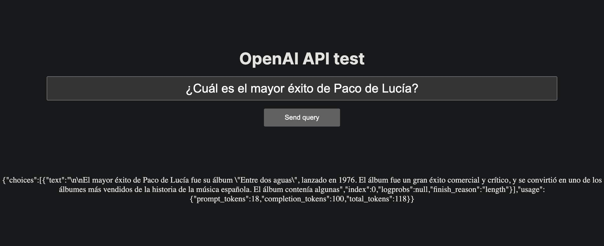

# OpenAI Api Playground


## Getting Started

Create your `.env` file with your OpenAI Api key, more info -> [Where do I find my api key?](https://help.openai.com/en/articles/4936850-where-do-i-find-my-secret-api-key)

Then:

- Run the development server:

```bash
npm run dev
```
- Go to http://localhost:3000 

- Enter a query

## Example:

<center></center>